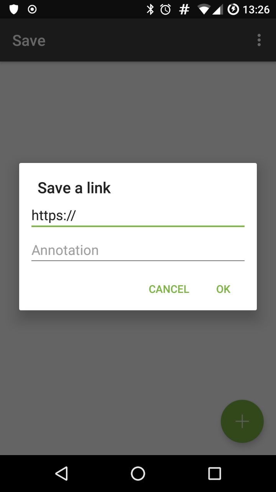
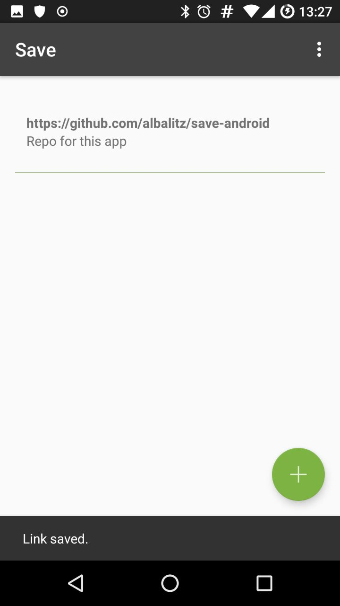

# save
An Android app for saving links to articles etc. on the go so you can read them later.

## screenshots
</a>  
Dialog for saving a link

</a>  
Saved link and confirmation

## features
- Save from another app  
  You can select this app from another app's share screen to save links directly to this app.
- Use local storage or api  
  In the preferences screen, you can choose to use the api (I haven't open sourced that one yet, but will probably do that soon).

## todo
- Allow editing a link received from another app before actually saving
- Edit saved links
- Export saved links
- Move locally saved links to api and vice versa
